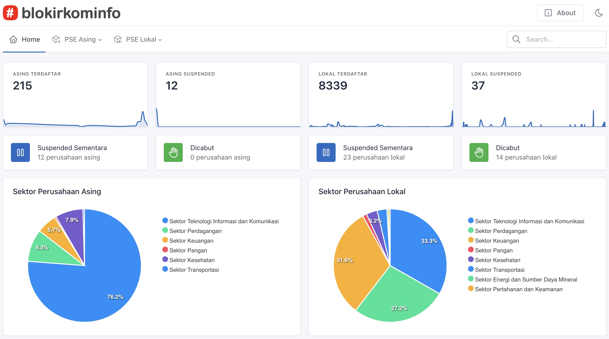

# Monitoring PSE Kominfo

Sebuah aplikasi berbasis web untuk memonitor perkembangan pendaftaran layanan PSE di Kominfo. Sebagai informasi, melalui Peraturan Kemkominfo No. 5/2020, seluruh penyedia layanan elektronik diwajibkan mendaftar ke pse.kominfo.go.id. Apabila tidak mendaftar, maka layanan tersebut akan diblokir.

Peraturan layanan PSE Kominfo mengancam kebebasan akses dan membahayakan perlindungan data pribadi penduduk Indonesia. Peraturan yang dibikin tanpa pertimbangan ini juga mengancam pertumbuhan pekerja dan semua usaha berbasis internet di Indonesia. Lawan!

Untuk menggunakan:

## Instalasi

1. Install `pipenv` atau pergunakan `virtualenv`.
2. Clone repository ini. `git clone https://github.com/lantip/monitor-pse.git`. Lalu masuk ke direktori monitor-pse: `cd monitor-pse`.
3. Install requirements: `pip install -r requirements.txt`
4. Ubah setting di `pse/env.example` dan rename menjadi `pse/.env`.
5. Jalankan `python manage.py migrate`.
6. Jalankan `python manage.py collectstatic`.
7. Setting `alias` di webserver agar mengarahkan `static` ke folder staticfiles yang disetup di `.env` 

## Menjalankan program
1. Jalankan `python manage.py runserver`. 
2. Untuk production gunakan gunicorn, uwsgi atau semacamnya, juga bisa dikombinasi dengan supervisor.

### Contoh:
1. Install gunicorn. `pip install gunicorn`.
2. Buat file `gunicorn_config.py` di root folder.
3. Install supervisor. `apt-get install supervisor`.
4. Buat config file di `/etc/supervisor/conf/`.
5. Isikan config yang sesuai, untuk menjalankan `gunicorn -c gunicorn_config.py pse.wsgi`.

# Mengupdate Data
1. Jalankan crontab tiap periode tertentu, dengan command: `python manage.py rekampse`.